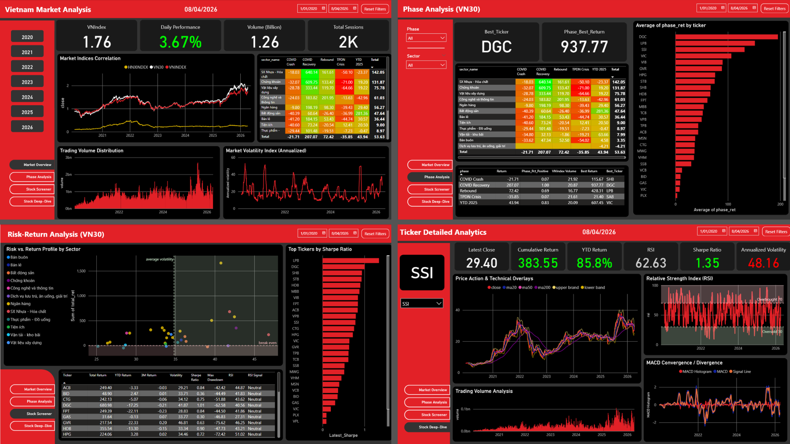

# 📊 VN30 Market Intelligence Dashboard

> **Phân tích định lượng Thị trường Chứng khoán Việt Nam — 2020 đến nay**  
> Dự án cá nhân 

[](https://python.org)
[](https://github.com/thinh-vu/vnstock)
[](https://powerbi.microsoft.com)

---

## Mục lục

1. [Tổng quan dự án](#1-tổng-quan-dự-án)
2. [Cấu trúc thư mục](#2-cấu-trúc-thư-mục)
3. [Dữ liệu & Nguồn](#3-dữ-liệu--nguồn)
4. [Cài đặt & Chạy](#4-cài-đặt--chạy)
5. [Workflow chi tiết](#5-workflow-chi-tiết)
6. [Phân tích kỹ thuật — Indicators](#6-phân-tích-kỹ-thuật--indicators)
7. [5 Giai đoạn thị trường](#7-5-giai-đoạn-thị-trường)
8. [Output Files](#8-output-files)
9. [Power BI Dashboard](#9-power-bi-dashboard)
10. [Hướng phát triển](#10-hướng-phát-triển)
11. [Tác giả](#11-tác-giả)

---

## 1. Tổng quan dự án

### Vấn đề đặt ra

Thị trường chứng khoán Việt Nam trải qua **5 giai đoạn biến động cực lớn** trong 5 năm qua — COVID crash, bùng nổ F0, khủng hoảng TPDN, phục hồi và kỳ vọng nâng hạng FTSE. Nhà đầu tư cần một nền tảng phân tích:

- Nhìn thấy **toàn bộ lịch sử** theo từng giai đoạn thị trường cụ thể
- So sánh **risk-adjusted return** thay vì chỉ xem giá tăng/giảm
- **Cập nhật dữ liệu tự động** mỗi ngày mà không cần chạy lại toàn bộ pipeline

### Giải pháp

Xây dựng **end-to-end data pipeline** từ thu thập → phân tích → dashboard:

```
vnstock API  →  Python Pipeline  →  CSV files  →  Power BI Dashboard
                                                          ↑
                                    update_data.py (daily append)
```

### Điểm nổi bật kỹ thuật

| Kỹ năng | Ứng dụng trong dự án |
|---------|----------------------|
| **Python / pandas** | ETL pipeline, 15+ technical indicators, phase classification |
| **vnstock API** | Auto-discovery VN30 tickers, rate-limit management |
| **Quantitative Finance** | Sharpe Ratio, Calmar Ratio, Max Drawdown, Volatility Regime |
| **Data Visualization** | 5 publication-quality charts với phase annotation |
| **Power BI / DAX** | Star schema, 15+ DAX measures, 4-page interactive dashboard |

---

## 2. Cấu trúc thư mục

```
vn30-market-intelligence/
│
├── 📓 vn30_analysis.ipynb       # Pipeline chính: ETL + Analysis + Export
├── 🔄 update_data.py            # Incremental updater — chạy hằng ngày
│
├── 📁 output/                   # CSV files → Power BI import
│   ├── price_history.csv        # OHLCV + 20+ indicators (30 mã × ~5 năm)
│   ├── market_index.csv         # VN-Index, HNX-Index, VN30 daily
│   ├── summary_stats.csv        # 1 dòng/mã: Sharpe, Drawdown, YTD...
│   └── phase_perf.csv           # Return từng mã × từng giai đoạn
│
├── 📁 assets/                   # Charts xuất từ notebook
│   ├── 01_vnindex.png           # VN-Index + Volume + Volatility (3-panel)
│   ├── 02_sector_heatmap.png    # Ngành × Năm heatmap
│   ├── 03_risk_return.png       # Risk-Return scatter
│   ├── 04_volatility_regime.png # Box plot volatility theo giai đoạn
│   └── 05_ytd_momentum.png      # YTD Top & Bottom 10
│
├── 📄 README.md                 # File này
└── 📄 requirements.txt          # Python dependencies
```

---

## 3. Dữ liệu & Nguồn

### Nguồn dữ liệu

| Nguồn | Module | Dữ liệu |
|-------|--------|---------|
| **KB Securities (KBS)** | `vnstock.Listing`, `vnstock.Quote` | Giá OHLCV, danh mục VN30, ngành ICB |
| **Vietcap (VCI)** | `vnstock.Finance` | Báo cáo tài chính (mở rộng phase 2) |


### Phạm vi dữ liệu

```
Thời gian : 2020-01-01 → today (tự động cập nhật)
Danh mục  : VN30 — tự động fetch từ Listing.symbols_by_group('VN30')
Tần suất  : Daily (ngày giao dịch)
Chỉ số    : VNINDEX, HNXINDEX, VN30
```

### Rate Limit & Quota

| Tier | Rate Limit | Đăng ký | Ghi chú |
|------|-----------|---------|---------|
| Guest | 20 req/phút | Không cần | Mặc định, đủ cho dự án này |
| Community | 60 req/phút | Miễn phí tại [vnstocks.com](https://vnstocks.com/login) | Nhanh hơn 3x |
| Sponsor | 100+ req/phút | Có phí | Không cần cho dự án này |

Pipeline tự động nghỉ 62 giây sau mỗi 20 lần gọi API — không cần can thiệp thủ công.

---

## 4. Cài đặt & Chạy

### Yêu cầu

```
Python >= 3.10
Power BI Desktop (free) — để xem dashboard
```

### Cài đặt thư viện

```bash
pip install -r requirements.txt
```

`requirements.txt`:
```
vnstock>=3.0.0
pandas>=2.0.0
numpy>=1.24.0
matplotlib>=3.7.0
seaborn>=0.12.0
scikit-learn>=1.3.0
```

### Chạy lần đầu (full history)

```bash
# Option 1: Chạy Jupyter Notebook (có visualization)
jupyter notebook vn30_analysis.ipynb
# → Chạy từ đầu đến cuối (Kernel > Restart & Run All)
# → Thời gian: ~3–5 phút (30 mã, 2 batch)

# Option 2: Chạy trực tiếp bằng nbconvert
jupyter nbconvert --to notebook --execute vn30_analysis.ipynb --inplace
```

### Cập nhật dữ liệu hằng ngày

```bash
# Chạy sau khi thị trường đóng cửa (15:15 hoặc sau)
python update_data.py

# Sau đó mở Power BI Desktop → Refresh
# (hoặc dùng Power BI Service + Scheduled Refresh)
```

---

## 5. Workflow chi tiết

### 5.1 Full Pipeline (lần đầu)

```
vn30_analysis.ipynb
│
├── Phase 0: Setup & Config
│   ├── Import libraries
│   ├── Khai báo START='2020-01-01', END=date.today()
│   └── Định nghĩa 5 PHASE_SPANS + 8 KEY_EVENTS
│
├── Phase 1: Universe Discovery
│   ├── Listing.symbols_by_group('VN30') → 30 tickers (auto)
│   └── Listing.symbols_by_industries()  → sector map
│
├── Phase 2: Price Data (batch fetch)
│   ├── Loop 30 tickers
│   ├── Quote.history(start, end, interval='d')
│   └── Nghỉ 62s sau mỗi 20 lần gọi
│
├── Phase 3: Data Cleaning & Indicators
│   ├── Normalize columns, parse dates
│   ├── Tag phase theo ngày
│   └── add_indicators(): 20+ chỉ báo kỹ thuật
│
├── Phase 4: Market Indices
│   └── VNINDEX, HNXINDEX, VN30 history
│
├── Phase 5: Visualisation (5 charts)
│   ├── 01_vnindex.png
│   ├── 02_sector_heatmap.png
│   ├── 03_risk_return.png
│   ├── 04_volatility_regime.png
│   └── 05_ytd_momentum.png
│
└── Phase 6: Export
    ├── price_history.csv
    ├── market_index.csv
    ├── summary_stats.csv
    └── phase_perf.csv
```

### 5.2 Incremental Update (hằng ngày)

```
update_data.py
│
├── Đọc output/price_history.csv → lấy ngày cuối cùng
├── Fetch chỉ từ ngày đó đến hôm nay (ít request hơn rất nhiều)
├── Append rows mới vào DataFrame
├── Recalculate toàn bộ indicators (cần 200-day lookback)
├── Ghi đè CSV
└── Cập nhật: market_index, summary_stats, phase_perf
```

**Thời gian chạy update hằng ngày:** < 5 phút (chỉ fetch 1–5 ngày mới).

---

## 6. Phân tích kỹ thuật — Indicators

Tất cả indicators được tính bằng pandas thuần — không dùng thư viện thứ ba.

### Returns

| Cột | Công thức | Ý nghĩa |
|-----|-----------|---------|
| `ret_1d` | `close.pct_change()` | Daily return |
| `ret_1w` | `close.pct_change(5)` | 1-week return |
| `ret_1m` | `close.pct_change(21)` | 1-month return |
| `ret_3m` | `close.pct_change(63)` | 3-month momentum |
| `ret_6m` | `close.pct_change(126)` | 6-month momentum |
| `ret_1y` | `close.pct_change(252)` | 1-year return |
| `cum_ret` | `(close / close.iloc[0] - 1) * 100` | Return từ 01/01/2020 |
| `ytd_ret` | `(close / close_start_of_year - 1) * 100` | Year-to-Date return |

### Trend Indicators

| Cột | Tham số | Công thức |
|-----|---------|-----------|
| `ma_20` | SMA 20 | `close.rolling(20).mean()` |
| `ma_50` | SMA 50 | `close.rolling(50).mean()` |
| `ma_200` | SMA 200 | `close.rolling(200).mean()` |
| `bb_up` | BB Upper | `ma_20 + 2 * std(20)` |
| `bb_lo` | BB Lower | `ma_20 - 2 * std(20)` |
| `bb_pct` | BB %B | `(close - bb_lo) / (bb_up - bb_lo)` → 0–1 |

### Momentum & Oscillator

| Cột | Tham số | Diễn giải |
|-----|---------|-----------|
| `rsi` | RSI(14) | > 70 = overbought, < 30 = oversold |
| `macd` | EMA(12) − EMA(26) | Positive = bullish momentum |
| `macd_sig` | EMA(9) của MACD | Crossover với MACD = tín hiệu |
| `macd_hist` | MACD − Signal | Histogram: momentum acceleration |

### Risk & Volatility

| Cột | Công thức | Ý nghĩa |
|-----|-----------|---------|
| `vol_ann` | `ret_1d.rolling(20).std() × √252 × 100` | Volatility annualized (%) |
| `vol_ratio` | `volume / volume.rolling(20).mean()` | Volume surge (> 1.5 = bất thường) |

### Risk Metrics (summary_stats.csv)

| Metric | Công thức | Ngưỡng tham chiếu |
|--------|-----------|-------------------|
| **Sharpe Ratio** | `(ann_ret - Rf) / ann_vol` (Rf = 5%) | > 1.0 = tốt, > 2.0 = xuất sắc |
| **Calmar Ratio** | `ann_ret / \|max_drawdown\|` | > 1.0 = risk management tốt |
| **Max Drawdown** | `min((close / cummax) - 1) × 100` | < -30% = rủi ro cao |
| **Volatility** | `std(ret_1d) × √252 × 100` | < 20% = ổn định, > 35% = cao |

---

## 7. 5 Giai đoạn thị trường

Toàn bộ dữ liệu được gắn nhãn phase tự động theo ngày:

```python
def tag_phase(date):
    if date < 2020-03-25:  return "1_COVID_Crash"
    if date < 2022-01-01:  return "2_COVID_Recovery"
    if date < 2022-11-16:  return "3_TPDN_Crisis"
    if date < 2025-01-01:  return "4_Rebound"
    return "5_YTD_2025"
```

| # | Giai đoạn | Khoảng thời gian | VN-Index | Avg Vol |
|---|-----------|-----------------|----------|---------|
| 1 | **COVID Crash** | 01/2020 – 03/2020 | −35% (7 tuần) | ~45% |
| 2 | **COVID Recovery** | 04/2020 – 12/2021 | +130% từ đáy | ~28% |
| 3 | **TPDN Crisis** | 01/2022 – 11/2022 | −42% từ đỉnh | ~34% |
| 4 | **Rebound** | 12/2022 – 12/2024 | +47% từ đáy | ~21% |
| 5 | **YTD 2025** | 01/2025 → nay | +3.1%* | ~18% |

_(*) Cập nhật đến 31/03/2025_

---

## 8. Output Files

### `price_history.csv`

File lớn nhất (~35,000 rows). Dùng cho Power BI trang Price Analytics và Sector View.

| Cột | Kiểu | Mô tả |
|-----|------|-------|
| `ticker` | string | Mã cổ phiếu (VCB, SSI, FPT...) |
| `sector` | string | Ngành ICB (Ngân hàng, IT...) |
| `phase` | string | Giai đoạn thị trường (1_COVID_Crash...) |
| `date` | datetime | Ngày giao dịch |
| `year`, `quarter`, `month`, `week` | int | Time metadata |
| `open`, `high`, `low`, `close` | float | OHLC (VND) |
| `volume` | float | Khối lượng giao dịch (cổ phiếu) |
| `ret_1d` ... `ret_1y` | float | Returns các kỳ |
| `cum_ret`, `ytd_ret` | float | Cumulative & YTD return (%) |
| `ma_20`, `ma_50`, `ma_200` | float | Simple Moving Averages |
| `bb_up`, `bb_lo`, `bb_pct` | float | Bollinger Bands |
| `rsi` | float | RSI 14 (0–100) |
| `macd`, `macd_sig`, `macd_hist` | float | MACD indicators |
| `vol_ann`, `vol_ratio` | float | Annualized volatility, volume surge |

### `market_index.csv`

~3,800 rows. Dùng cho Power BI trang Market Overview.

| Cột | Mô tả |
|-----|-------|
| `symbol` | VNINDEX / HNXINDEX / VN30 |
| `date`, `year`, `month` | Time metadata |
| `close`, `volume` | Điểm số và khối lượng |
| `ret_1d`, `cum_ret` | Daily return, cumulative return từ 2020 |
| `vol_ann` | Rolling 20-day annualized volatility |
| `phase` | Giai đoạn thị trường |

### `summary_stats.csv`

30 rows (1 dòng/mã). Dùng cho Power BI trang Screener.

| Cột | Mô tả |
|-----|-------|
| `ticker`, `sector` | Định danh |
| `total_ret` | Return từ 01/01/2020 (%) |
| `volatility` | Annualized volatility toàn kỳ (%) |
| `sharpe` | Sharpe Ratio (Rf = 5%) |
| `max_dd` | Maximum Drawdown (%) |
| `calmar` | Calmar Ratio |
| `latest_close` | Giá đóng cửa mới nhất |
| `latest_rsi` | RSI 14 mới nhất |
| `latest_ytd` | YTD return (%) |
| `latest_ret_3m` | Return 3 tháng gần nhất (%) |
| `latest_vol` | Volatility 20-day gần nhất (%) |
| `data_from`, `data_to` | Khoảng thời gian data |

### `phase_perf.csv`

~150 rows (30 mã × 5 giai đoạn). Dùng cho Power BI trang Phase Analysis.

| Cột | Mô tả |
|-----|-------|
| `ticker`, `sector` | Định danh |
| `phase` | Mã giai đoạn (1_COVID_Crash...) |
| `phase_ret` | Return trong giai đoạn đó (%) |

---

## 9. Power BI Dashboard

Dashboard gồm **4 trang tương tác**, xây dựng theo Star Schema:

```
dim_date ─────────────────────────────────────────────┐
dim_ticker ──────────────────────────────────────────┐ │
dim_phase ─────────────────────────────────────────┐ │ │
                                                   ↓ ↓ ↓
                              fact_price ──── fact_index
                              fact_summary
                              fact_phase
```

### Các trang dashboard

| Trang | Tên | Nội dung chính |
|-------|-----|----------------|
| 1 | **Market Overview** | VN-Index 5 giai đoạn, Phase heatmap matrix, Volume bar, Volatility line |
| 2 | **Phase Analysis** | So sánh return ngành × giai đoạn, Volatility regime box plot |
| 3 | **Stock Screener** | Risk-Return scatter, Sharpe ranking, Bộ lọc 4 slicers |
| 4 | **Stock Deep-Dive** | Price + MA + BB, Volume, RSI, MACD — drillthrough từ Trang 3 |



### DAX Measures quan trọng

```dax
-- Sharpe Ratio
Latest_Sharpe = MAX(fact_summary[sharpe])

-- RSI status
RSI_Status = 
    VAR r = [Latest_RSI]
    RETURN SWITCH(TRUE(),
        r >= 70, "Overbought ⚠️",
        r <= 30, "Oversold 🟢",
        "Neutral")

-- Momentum Rank trong VN30
Momentum_Rank = 
    RANKX(ALL(dim_ticker[ticker]),
        CALCULATE(MAX(fact_summary[latest_ret_3m])),
        , DESC, SKIP)

-- % mã tăng trong phase đang filter
Phase_Pct_Positive =
    VAR total    = COUNTROWS(ALLSELECTED(fact_phase))
    VAR positive = COUNTROWS(FILTER(ALLSELECTED(fact_phase), fact_phase[phase_ret] > 0))
    RETURN DIVIDE(positive, total)
```


---

## 10. Hướng phát triển

| Phase | Nội dung | Kỹ thuật |
|-------|----------|----------|
| **Phase 2** | Bổ sung BCTC: P/E, P/B, ROE, EPS trend | `vnstock.Finance.ratio()` |
| **Phase 3** | Mô hình dự báo VN-Index: ARIMA + LSTM | `statsmodels`, `TensorFlow` |
| **Phase 4** | Portfolio Optimization: Markowitz Efficient Frontier | `scipy.optimize` |
| **Phase 5** | Sentiment Analysis từ tin tức tài chính | `BeautifulSoup`, NLP |
| **Phase 6** | Tích hợp dữ liệu macro: CPI, tỷ giá, FDI | FRED API, SBV data |

---

## 11. Tác giả

**[Liêu Bách Thành]**  

[](https://www.linkedin.com/in/lieubachthanh/)
[](https://github.com/lieubachthanh)
[](mailto:lieubachthanh@gmail.com)

---

> **Lưu ý:** Dự án sử dụng dữ liệu lịch sử từ thư viện `vnstock` (nguồn KB Securities).  
> Nội dung mang tính học thuật và nghiên cứu — không phải khuyến nghị đầu tư.
